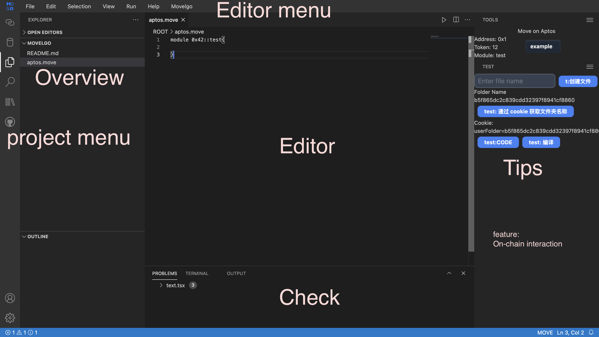
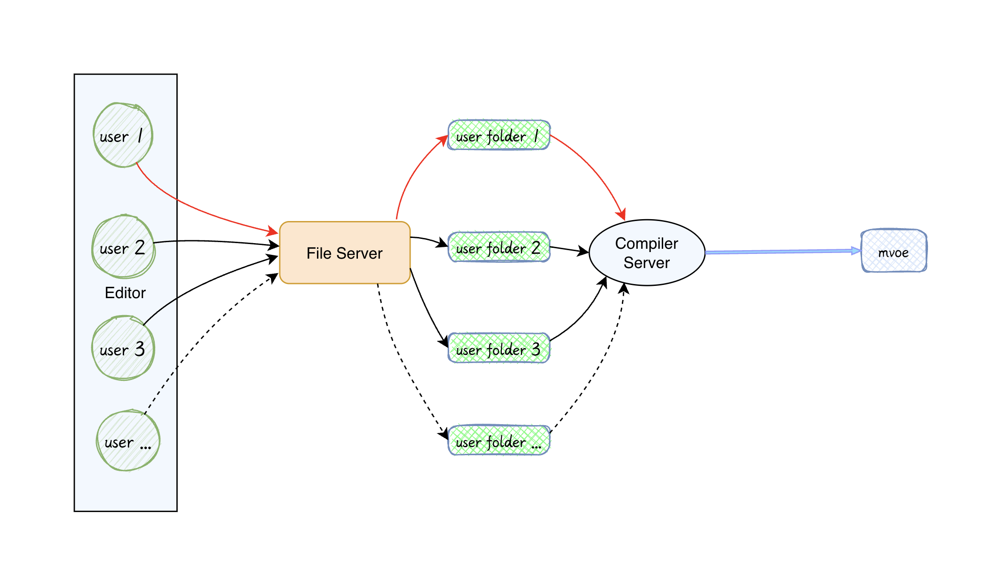

<a name="top"></a>
[](#top)


<br/>



<div style="display: flex; align-items: center; gap: 2px;">
  <a href="./DOC/README_zh.md" style="margin: 2px;">
    
  </a>
  <a href="./README.md" style="margin: 2px;">
    
  </a>
</div>

# Preface

There are many developers who are new to web3 and do not know how to start their first blockchain project. Although they are already very proficient in web2, this difficulty often comes from the objective environment. The most challenging part is setting up the environment, especially in countries where VPNs are needed. Beginners often do not know how to solve network issues, and public blockchains cannot provide direct help. Therefore, movelgo was born. We want to solve the "quick start" problem for developers and make writing code simpler.

We hope to provide developers with a simple and convenient development, testing, and deployment environment through an integrated web development environment. In the later stage, we hope to achieve the features in the Move compiler that are inaccessible for security reasons but extremely important for understanding the compiled code.

Thank you for your reading, thank you again!

# 🚀 Start

- `./init.sh` Initialize the project

  > download Aptos CLI, Rust, TypeScript Node, Yarn, NVM, and install dependencies from `package.json`.

- `./run.sh` Start the project

  > check the package manager and start the RPC server, file server, and editor.

- `./status.sh` Check the running status

  > check if there are any processes running on ports 3000, 3010, and 3020.

- `./stop.sh` Stop the running project
  > stop the programs running on ports 3000, 3010, and 3020.

## 🚦 Shortcut Keys

> - `Ctrl` / `Command` => `C`
> - `Shift` => `S`

- `C-K` Set Theme

- `C-P` Search

- `C-S-L` Set Language

## :computer: About the Project

:wrench: Movelgo is built using [Molecule IDE UI](https://github.com/DTStack/molecule).

This is a Move language IDE, aimed at creating a Remix-like online development environment for Move.

This project is built with React, and Move code is compiled in the backend.


## :crystal_ball: Introduction:

1. Users write code at `http://localhost:3000/`
2. Users click the compile button, and the code is sent to the backend file server via `http://localhost:3010/` to save the code
3. The file server sends to the backend `http://localhost:3020` to compile the code and returns the compilation result to the frontend
4. The frontend displays the compilation result in the OUTPUT window

## :rocket: Goals

1. Implement an online Move development environment

# :scroll: Project Architecture

- [`./src`](./src/) Editor
- [`./rpc`](./rpc/) Move Compilation Service
- [`./users-file`](./users-file/) File Service



# :running: Start the Project

## :rainbow: Prerequisites (option)

> In the `init.sh`, we have provided a "one-click installation" script, which currently only has versions for Mac and Linux (Ubuntu).

- [Install `Aptos CLI`](https://aptos.dev/en/build/cli)

  - MAC

    ```bash
    brew install aptos  # macOS
    ```

  - Linux

    ```bash
    curl -fsSL "https://aptos.dev/scripts/install_cli.py" | python3
    # or
    ```

  - Windows

    ```bash
    iwr "https://aptos.dev/scripts/install_cli.py" -useb | Select-Object -ExpandProperty Content | python3
    ```

2. [Install `Rust`](https://www.rust-lang.org/tools/install)

- Mac / Linux

  ```bash
  curl --proto '=https' --tlsv1.2 -sSf https://sh.rustup.rs | sh
  ```

- Windows

  https://forge.rust-lang.org/infra/other-installation-methods.html

3. [Install `Nodejs`](https://nodejs.org/zh-cn/download/package-manager)
   > [!TIP]
   >
   > [Recommended to use `nvm`](https://github.com/nvm-sh/nvm)
   >
   > ```bash
   > curl -o- https://raw.githubusercontent.com/nvm-sh/nvm/v0.39.7/install.sh | bash
   > # or
   > wget -qO- https://raw.githubusercontent.com/nvm-sh/nvm/v0.39.7/install.sh | bash
   > ```

## Install Dependencies

> [!TIP] Tip
> It is recommended to use
>
> `yarn` or `pnpm` to install dependencies
>
> ```bash
> npm install -g yarn
> # or
> npm install -g pnpm
> ```

```bash
yarn
# or
pnpm install
# or
npm install
```

## :car: Auto Run (Background)

1. [`./init.sh`](./init.sh) Initialize the project (check configuration and download dependencies)

2. [`./run.sh`](./run.sh) Run the project (start the editor, compilation service, file service)

3. [`./stop.sh`](./stop.sh) Stop the project (stop the project according to the port)

## :muscle: Manual Start (Foreground)

```bash
yarn start
# New terminal
cd rpc/server
cargo run
# New terminal
cd users-file
ts-node server.ts
```

# :evergreen_tree: Testing

## Check Installation Status

```bash
cd rpc/move
aptos move init --name user
aptos init --network testnet
aptos move test
```

## :file_folder: rpc (rust)

In terminal

```bash
curl -X POST -d 'module 0x12::test{
  use std::debug::print;
  use std::string::utf8;
  #[test]
  fun test_server(){
    print(&utf8(b"server is running"));
  }
}' http://127.0.0.1:3020/move_test
```

## :file_folder: user_file

```bash
ts-node ./users-file/server.ts
```

Access in browser (default): http://localhost:3010

## :file_folder: react

`yarn start`

Access in browser (default): http://localhost:3000

## :tada: Done

# :airplane: Future

## In Development

- [ ] Optimize UI
- [ ] On-chain Interaction

## Planned Development

- [ ] Optimize client-side compilation experience
- [ ] Debugging
- [ ] Move Code Highlighting
- [ ] Move Code Completion
- [ ] Optimize File Service

# :star: Contribution

Issues and PRs are welcome

# :link: Links

- [Molecule](https://github.com/DTStack/molecule)
- [Aptos](https://aptos.dev/)
- [Rust](https://www.rust-lang.org/)
- [Nodejs](https://nodejs.org/zh-cn/)

# :recycle: Resources

[molecule example](https://dtstack.github.io/molecule/zh-CN/docs/guides/extend-builtin-ui)

[molevule doc](https://dtstack.github.io/molecule/zh-CN/docs/introduction)

[icon](https://microsoft.github.io/vscode-codicons/dist/codicon.html)

[remix](https://remix.ethereum.org/#lang=zh)

[markdown emoji](https://gist.github.com/rxaviers/7360908)
